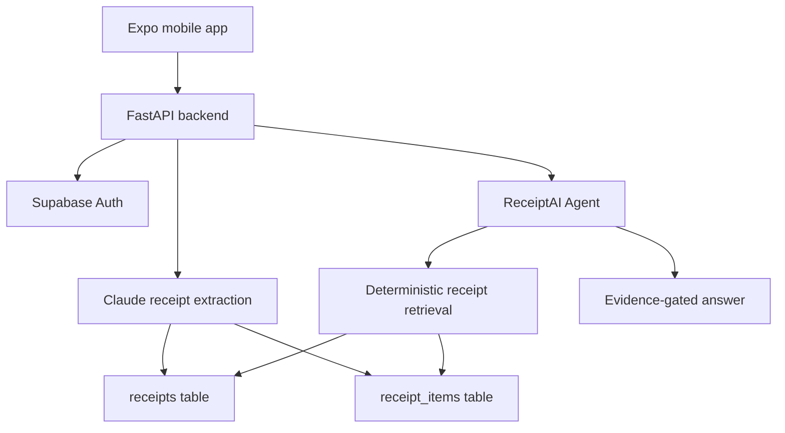

# ReceiptAI

ReceiptAI is a full-stack receipt scanner and shopping intelligence app. It scans receipts, stores clean purchase history, and answers natural-language questions with evidence from the user's own receipt data.

```text
Mobile app -> Backend API -> Supabase receipt data -> Evidence-first AI Agent
```

## What It Does

| Area | Capability |
| --- | --- |
| Receipt scanning | Upload receipt images or PDFs and extract structured purchase data |
| Purchase memory | Save receipts, line items, totals, stores, dates, quantities, and guest sessions |
| AI Agent | Ask about prices, stores, spending, item history, comparisons, and shopping decisions |
| Evidence gate | Receipt facts must come from saved receipt evidence, not model guesses |
| General advice | Food, shopping, and savings advice is allowed when clearly separated from receipt facts |
| Deployment | Mobile app runs with Expo; backend deploys from `backend/` on Railway |

## Repository Layout

```text
ReceiptScanner/
  mobile/                 Expo / React Native app
  backend/                FastAPI backend
    app/
      routes/             Auth, receipt, query, and agent routes
      services/           Scanning, storage, retrieval, and agent logic
    main.py               FastAPI entrypoint
    requirements.txt      Python dependencies
    Procfile              Railway start command
    nixpacks.toml         Railway build config
    supabase_*.sql        Supabase migrations
```

## System Flow



## Agent Architecture

The Agent is designed to behave like a helpful shopping assistant without inventing receipt facts.

| Module | Responsibility |
| --- | --- |
| `backend/app/services/agent.py` | Main orchestrator |
| `backend/app/services/agent_architecture.py` | Evidence gate, answer contract, trace metadata |
| `backend/app/services/agent_general.py` | General shopping and food advice mode |
| `backend/app/services/agent_analytics.py` | Spending, summary, and trend routing |
| `backend/app/services/receipt_intelligence.py` | Deterministic receipt Q&A and item matching |

Core rule:

```text
If the user asks what they bought, where they bought it, or how much they paid,
the answer must be backed by matching receipt evidence.
```

## Local Development

### Mobile App

From the repository root:

```powershell
cd mobile
npm install
npx expo start --lan -c
```

Use `--lan` when testing with Expo Go on a phone connected to the same Wi-Fi network.

### Backend

From the repository root:

```powershell
cd backend
python -m venv .venv
.\.venv\Scripts\Activate.ps1
pip install -r requirements.txt
uvicorn main:app --reload
```

Local API:

```text
http://127.0.0.1:8000
```

FastAPI docs:

```text
http://127.0.0.1:8000/docs
```

## Environment Variables

Backend-only secrets belong in Railway or `backend/.env`. Never put service keys in `mobile/`.

```env
SUPABASE_URL=
SUPABASE_KEY=
SUPABASE_SERVICE_KEY=
ANTHROPIC_API_KEY=
OPENAI_API_KEY=
AGENT_OPENAI_ENABLED=true
OPENAI_ROUTER_MODEL=gpt-4o-mini
OPENAI_GENERAL_MODEL=gpt-4o-mini
GOOGLE_SEARCH_API_KEY=
GOOGLE_SEARCH_ENGINE_ID=
```

Important:

- `SUPABASE_SERVICE_KEY` is backend-only.
- Mobile code should use only public/frontend-safe variables.
- Do not commit `.env` files.

## Supabase Setup

Run these migrations once in the Supabase SQL Editor:

```text
backend/supabase_receipt_items.sql
backend/supabase_item_aliases.sql
```

These create:

- `receipt_items` for fast structured item retrieval.
- `receipt_item_aliases` for taught meanings such as `goat = mutton`.

## API Highlights

| Method | Route | Purpose |
| --- | --- | --- |
| `POST` | `/auth/signup` | Create account |
| `POST` | `/auth/login` | Sign in |
| `POST` | `/scan-receipt` | Scan authenticated receipt |
| `POST` | `/guest/scan-receipt` | Scan guest receipt |
| `GET` | `/receipts` | List receipts |
| `GET` | `/summary` | Spending summary |
| `POST` | `/agent` | Ask the AI Agent |
| `POST` | `/agent/chat` | Chat-style Agent request |
| `GET` | `/agent-health` | Verify deployed backend build and config |

## Deployment

### Railway Backend

Railway should point to this repository:

```text
reddy-rbg/receipt-scanner-app
```

Use these Railway source settings:

```text
Branch: main
Root Directory: /backend
```

Health check:

```text
https://web-production-3605f4.up.railway.app/agent-health
```

### Expo App

Expo/EAS should build from:

```text
mobile/
```

## Quality Gates

The backend includes hard-scenario tests for the Agent, including typo-heavy questions, missing punctuation, item matching, store matching, spending summaries, and evidence gating.

Useful checks:

```powershell
cd backend
python test_receipt_intelligence_v2.py
python test_agent_hard_scenarios.py
python test_agent_quality_gate.py
```

Mobile type check:

```powershell
cd mobile
npx tsc --noEmit
```

## Git Workflow

Commit from the monorepo root using repository-relative paths:

```powershell
git status
git add README.md backend mobile
git commit -m "Describe your change"
git push
```

## Project Rule

ReceiptAI should feel intelligent, but receipt answers must stay honest:

```text
No receipt evidence -> no purchase claim.
```

## License

Copyright (c) 2026 Ajay Kumar Reddy Poreddy. All rights reserved.

This repository and the ReceiptAI project are proprietary and confidential. No permission is granted to copy, clone, fork, distribute, modify, reuse, commercialize, or create derivative works from this codebase, design, architecture, workflows, or product concept without prior written permission from the owner. Patent and copyright protections may apply.
