<div align="center">



# ReceiptAI

### Turn every receipt into searchable purchase memory.

ReceiptAI scans receipt images and PDFs, remembers what was purchased, and answers shopping questions with traceable evidence instead of guesses.

<p>
  
  
  
  
  
</p>

<p>
  <a href="#-the-receipt-intelligence-loop"><b>Architecture</b></a>
  ·
  <a href="#-quick-start"><b>Quick start</b></a>
  ·
  <a href="#-operations-console"><b>Operations</b></a>
  ·
  <a href="./docs/RELEASE_RUNBOOK.md"><b>Release runbook</b></a>
</p>

</div>

---

> [!IMPORTANT]
> **ReceiptAI's evidence promise:** no receipt evidence means no purchase claim.<br>
> General shopping advice is allowed, but purchase history, prices, stores, dates, and totals must be supported by saved receipt data.

## ✦ The product in one glance

| Capture | Understand | Remember |
| :--- | :--- | :--- |
| Scan photos, gallery images, digital PDFs, and multi-page receipts. | Route digital tables through a zero-token parser and use Claude Vision when confidence is low. | Store receipts, items, prices, discounts, dates, stores, and purchase occasions. |
| **Ask** | **Operate** | **Protect** |
| Ask natural questions about spending, prices, stores, repeat purchases, and shopping plans. | Monitor token usage, estimated cost, warnings, errors, request IDs, assignments, and audit activity. | Enforce backend RBAC, customer scopes, support grants, receipt assignments, and evidence gates. |

### From paper to proof

```text
CAPTURE  →  EXTRACT  →  VALIDATE  →  REMEMBER  →  RETRIEVE  →  ANSWER
   receipt image       confidence      purchase        matching       cited
   or digital PDF      + page audit    memory          evidence       result
```

The result is more than OCR. ReceiptAI builds a private, queryable record of real-world purchases and makes that record useful through a conversational Agent.

## ✦ The Receipt Intelligence Loop



The architecture is designed as three connected journeys around one shared trust core:

| Journey | Path | Design goal |
| --- | --- | --- |
| **Scan** | Mobile → scan router → parser or vision → confidence gate → purchase memory | Use the least expensive reliable extraction path |
| **Ask** | Question → typed intent plan → retrieval → evidence gate → answer | Keep every purchase claim grounded in stored receipts |
| **Operate** | Ops console → RBAC guard → usage, issues, assignments, and audit | Make production behavior visible without bypassing data scopes |

At the center, FastAPI owns authentication checks, authorization, orchestration, validation, and API contracts. Supabase is the durable purchase-memory and access-control store. Claude is an extraction and reasoning dependency—not the source of truth.

<details>
<summary><b>Scan journey: cost-aware extraction</b></summary>

ReceiptAI does not send every document directly to a model.

1. Detect the uploaded document type.
2. Parse digital text/table PDFs deterministically.
3. Audit pages, rows, prices, totals, vendor signals, and warnings.
4. Accept only a strong parse.
5. Fall back to Claude Vision for receipt photos or weak PDF parses.
6. Normalize and save the receipt, line items, discounts, and scan telemetry.
7. Return an existing receipt for duplicate file hashes without another model call.

| Input | Primary path | Safety net |
| --- | --- | --- |
| Digital table or price-list PDF | Deterministic parser | Claude Vision when page or row confidence is low |
| Photographed receipt | Image optimization + Claude Vision | Readability and output validation |
| Multi-page receipt | Combined page scan | Page limits and duplicate checks |
| Duplicate upload | Existing receipt lookup | No additional model call |

</details>

<details>
<summary><b>Ask journey: one intent, retrieved evidence</b></summary>

Each Agent turn creates one typed `IntentPlan`. Planning, retrieval, and answer generation share that plan so the user's question is not repeatedly reinterpreted.

```text
question
  └─ intent plan
      └─ scoped receipt retrieval
          └─ deterministic purchase intelligence
              └─ evidence gate
                  └─ answer + trace
```

The workflow counts unique purchase occasions, aligns headline counts with listed evidence, invalidates short-lived caches after mutations, and moves blocking model/database work off the FastAPI event loop.

</details>

<details>
<summary><b>Operate journey: visibility with boundaries</b></summary>

The operations console is served by the backend, but every privileged action remains protected by backend authorization.

- Platform and customer-scoped operator management
- Receipt correction and filtered receipt-editor assignments
- Time-limited support access
- Token usage by calendar range, model, operation, and file type
- Issue tracking by date, severity, source, type, request ID, and text
- Security-sensitive audit history

</details>

## ✦ Trust by construction

| Boundary | Enforcement |
| --- | --- |
| Purchase truth | Receipt facts require matching stored evidence |
| Tenant isolation | Customer, user, support-grant, or receipt-assignment scope |
| Unknown receipts | Unauthorized and nonexistent resources return the same not-found behavior |
| Privileged actions | FastAPI permission checks; the UI is never the security boundary |
| Weak extraction | Confidence validation before persistence |
| AI cost | Parser-first routing, image optimization, duplicate detection, and token telemetry |
| Production diagnosis | Structured logs, request IDs, slow-request warnings, issues, and health routes |

### Production roles

| Role | Scope |
| --- | --- |
| `platform_admin` | Full platform, customer, role, setting, and audit administration |
| `master_user` | Cross-customer receipts, reports, analytics, support approval, and audit |
| `customer_owner` | Members, receipts, corrections, analytics, and support approval for one customer |
| `customer_user` | The user's own receipts and purchase history |
| `support_agent` | Approved, time-limited access only; no customer data by default |
| `receipt_editor` | Assigned correction work without deletion or user administration |
| `auditor` | Read-only assigned receipt and audit scopes |
| `service_account` | Explicit scan or reprocessing permissions for trusted jobs |

The complete permission matrix and support workflow live in [`docs/RBAC.md`](docs/RBAC.md).

## ✦ Repository map

```text
ReceiptScanner/
├─ mobile/                         Expo + React Native customer app
│  ├─ app/                         routes and screens
│  ├─ components/                  reusable product UI
│  └─ config/api.ts                backend URL resolution
│
├─ backend/                        FastAPI service + hosted web surfaces
│  ├─ app/
│  │  ├─ routes/                   auth, receipts, queries, Agent, RBAC
│  │  └─ services/                 extraction, memory, Agent, logging, access
│  ├─ ops_dashboard/               role-aware operations console
│  ├─ reset_password/              hosted account-recovery flow
│  ├─ supabase_*.sql               idempotent database migrations
│  ├─ railway.json                 deployment and health policy
│  ├─ nixpacks.toml                Python + Poppler build configuration
│  └─ main.py                      application entrypoint
│
├─ docs/                           security, privacy, readiness, and release
└─ assets/readme/                  project and architecture artwork
```

### Core backend modules

| Module | Responsibility |
| --- | --- |
| `app/services/claude.py` | Receipt extraction and model interaction |
| `app/services/receipt_intelligence.py` | Deterministic item matching and receipt Q&A |
| `app/services/agent.py` | Agent orchestration |
| `app/services/agent_contracts.py` | Shared typed intent contract |
| `app/services/agent_architecture.py` | Evidence gate, answer contract, and trace |
| `app/services/rbac.py` | Roles, scopes, support grants, and authorization |
| `app/services/token_usage.py` | Usage and estimated-cost telemetry |
| `app/services/app_logger.py` | Structured production logging and issue events |

## ✦ Quick start

### Prerequisites

- Python 3.11+
- Node.js 20+
- Expo Go or an Android/iOS simulator
- A Supabase project
- An Anthropic API key

### 1. Start the backend

```powershell
cd backend
Copy-Item .env.example .env
python -m venv .venv
.\.venv\Scripts\Activate.ps1
pip install -r requirements.txt
uvicorn main:app --reload
```

Configure the required values in `backend/.env`:

```env
ANTHROPIC_API_KEY=
SUPABASE_URL=
SUPABASE_KEY=
SUPABASE_SERVICE_KEY=
APP_ENV=development
PUBLIC_BASE_URL=http://127.0.0.1:8000
CORS_ALLOWED_ORIGINS=http://localhost:8081
```

Local API: `http://127.0.0.1:8000`<br>
OpenAPI docs: `http://127.0.0.1:8000/docs`

### 2. Prepare Supabase

Apply every `backend/supabase_*.sql` migration once in the Supabase SQL Editor. The scripts use idempotent creation patterns and establish receipt memory, Agent history, RBAC, token usage, issue tracking, indexes, and row-level security.

See [`docs/RELEASE_RUNBOOK.md`](docs/RELEASE_RUNBOOK.md) for the production order and verification queries.

### 3. Start the mobile app

```powershell
cd mobile
npm install
$env:EXPO_PUBLIC_API_URL="http://YOUR-LAN-IP:8000"
npx expo start --lan -c
```

Use the computer's LAN IP when testing with Expo Go on a physical phone connected to the same network.

## ✦ Operations console

Production console:

**[`https://web-production-3605f4.up.railway.app/ops/`](https://web-production-3605f4.up.railway.app/ops/)**

| Workspace | What operators can do |
| --- | --- |
| Users & access | Create operators, assign roles, inspect effective permissions |
| Receipts | Search, inspect, correct, and assign authorized receipt work |
| Token usage | Select presets or custom cross-year ranges; filter model, operation, and file type |
| Issues | Track warnings/errors by range, source, type, request ID, and search text |
| Audit | Review security-sensitive actions |

Optional blended token rates:

```env
AI_INPUT_COST_PER_MILLION_TOKENS=
AI_OUTPUT_COST_PER_MILLION_TOKENS=
```

These power reporting-only cost estimates. They do not block, schedule, or limit model work.

## ✦ API map

| Method | Route | Purpose |
| --- | --- | --- |
| `POST` | `/auth/signup` | Create an account |
| `POST` | `/auth/login` | Start a session |
| `POST` | `/scan-receipt` | Scan and save an authenticated receipt |
| `POST` | `/guest/scan-receipt` | Scan a guest receipt |
| `GET` | `/receipts` | List scoped receipts |
| `GET` | `/summary` | Return spending intelligence |
| `POST` | `/agent` | Ask the evidence-grounded Agent |
| `GET` | `/rbac/me` | Return effective roles, scopes, and permissions |
| `GET` | `/rbac/token-usage` | Query filtered AI usage |
| `GET` | `/rbac/error-events` | Query filtered production issues |
| `GET` | `/health/live` | Process liveness |
| `GET` | `/health/ready` | Runtime configuration readiness |

Interactive route documentation is available at `/docs` while the backend is running.

## ✦ Production and release

### Railway backend

```text
Repository:      reddy-rbg/receipt-scanner-app
Branch:          main
Root directory:  /backend
Health check:    /health/ready
```

Set `APP_ENV=production` in Railway. Production validation rejects missing secrets, non-HTTPS public URLs, wildcard CORS, and a service key that matches the anonymous Supabase key.

The Nixpacks configuration preserves the auto-detected Python provider while adding Poppler for PDF extraction:

```toml
[phases.setup]
nixPkgs = ["...", "poppler_utils"]
```

AI optimization keeps the existing production models by default. Exact
vision-token budgeting and prompt caching are enabled; structured output,
strict tools, and Haiku-first scan cascading remain guarded until staging
quality evaluation passes. See
[`docs/AI_OPTIMIZATION.md`](docs/AI_OPTIMIZATION.md) for model impact, rollout
flags, image-cost behavior, and verification.

### Release gate

```powershell
cd backend
python verify_release.py --offline
python -m pytest -q

cd ..\mobile
npx tsc --noEmit
npm audit --omit=dev --audit-level=critical
```

Then follow the device, migration, deployment, and rollback checks in [`docs/RELEASE_RUNBOOK.md`](docs/RELEASE_RUNBOOK.md).

## ✦ Project documentation

| Document | Purpose |
| --- | --- |
| [`docs/LAUNCH_READINESS.md`](docs/LAUNCH_READINESS.md) | Launch status and remaining gates |
| [`docs/RELEASE_RUNBOOK.md`](docs/RELEASE_RUNBOOK.md) | Deployment, migration, smoke-test, and rollback procedure |
| [`docs/RBAC.md`](docs/RBAC.md) | Role matrix, scopes, support grants, and authorization |
| [`docs/PRIVACY_POLICY.md`](docs/PRIVACY_POLICY.md) | Product privacy policy |
| [`docs/SECURITY_EXCEPTIONS.md`](docs/SECURITY_EXCEPTIONS.md) | Time-bounded dependency exception tracking |
| [`docs/AI_OPTIMIZATION.md`](docs/AI_OPTIMIZATION.md) | Token controls, model safety, prompt caching, and image strategy |

## License

Copyright © 2026 Ajay Kumar Reddy Poreddy. All rights reserved.

This repository and the ReceiptAI project are proprietary and confidential. No permission is granted to copy, clone, fork, distribute, modify, reuse, commercialize, or create derivative works from this codebase, design, architecture, workflows, or product concept without prior written permission from the owner.
