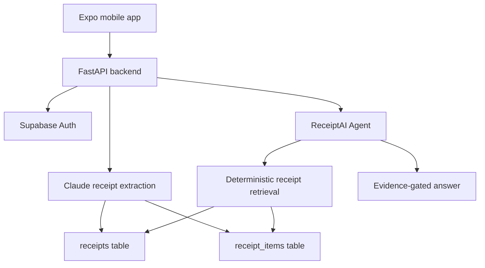

<div align="center">


# ReceiptAI

### A receipt scanner and shopping intelligence agent that answers from real purchase evidence.

<p>
  
  
  
  
</p>

<p>
  <b>Scan receipts</b> -> <b>save clean purchase memory</b> -> <b>ask the AI Agent</b> -> <b>get evidence-backed answers</b>
</p>

</div>

---

## Why ReceiptAI Exists

ReceiptAI turns messy receipts into a personal shopping memory. It helps answer practical questions like:

- What did I buy from Walmart?
- Which store gives me the best price for rice, milk, or vegetables?
- How much did I spend this month?
- Did I actually buy this item before?
- What should I buy next based on my receipt history?

The important rule is simple:

```text
No receipt evidence -> no purchase claim.
```

## Product Highlights

| Capability | What it means |
| --- | --- |
| Receipt scanning | Upload receipt images or PDFs and extract structured purchase data |
| Purchase memory | Store receipts, line items, totals, stores, dates, quantities, and guest sessions |
| AI Agent | Ask about prices, stores, item history, spending, comparisons, and shopping plans |
| Evidence gate | Receipt facts must come from saved receipt evidence, not model guesses |
| General advice | Food, shopping, and savings advice is supported without pretending it came from receipts |
| Mobile first | Built for Expo Go, local LAN testing, and future app-store builds |

## Architecture At A Glance



## Repository Layout

```text
ReceiptScanner/
  mobile/                 Expo / React Native app
  backend/                FastAPI backend
    app/
      routes/             Auth, receipt, query, and agent routes
      services/           Scanning, storage, retrieval, and agent logic
    main.py               FastAPI entrypoint
    requirements.txt      Python dependencies
    Procfile              Railway start command
    nixpacks.toml         Railway build config
    supabase_*.sql        Supabase migrations
  assets/readme/          README visuals
```

## Agent Brain

The Agent is structured so it can feel conversational while staying grounded.

| Module | Responsibility |
| --- | --- |
| `backend/app/services/agent.py` | Main orchestrator |
| `backend/app/services/agent_architecture.py` | Evidence gate, answer contract, trace metadata |
| `backend/app/services/agent_general.py` | General shopping and food advice mode |
| `backend/app/services/agent_analytics.py` | Spending, summary, and trend routing |
| `backend/app/services/receipt_intelligence.py` | Deterministic receipt Q&A and item matching |

Receipt fact answers are allowed only when matching receipt evidence is found.

## Run Locally

### Mobile App

```powershell
cd mobile
npm install
npx expo start --lan -c
```

Use `--lan` when testing with Expo Go on a phone connected to the same Wi-Fi network.

### Backend

```powershell
cd backend
python -m venv .venv
.\.venv\Scripts\Activate.ps1
pip install -r requirements.txt
uvicorn main:app --reload
```

Local API:

```text
http://127.0.0.1:8000
```

FastAPI docs:

```text
http://127.0.0.1:8000/docs
```

## Environment Variables

Backend-only secrets belong in Railway or `backend/.env`. Never put service keys in `mobile/`.

```env
SUPABASE_URL=
SUPABASE_KEY=
SUPABASE_SERVICE_KEY=
ANTHROPIC_API_KEY=
OPENAI_API_KEY=
AGENT_OPENAI_ENABLED=true
OPENAI_ROUTER_MODEL=gpt-4o-mini
OPENAI_GENERAL_MODEL=gpt-4o-mini
GOOGLE_SEARCH_API_KEY=
GOOGLE_SEARCH_ENGINE_ID=
```

Important:

- `SUPABASE_SERVICE_KEY` is backend-only.
- Mobile code should use only public/frontend-safe variables.
- Do not commit `.env` files.

## Supabase Setup

Run these migrations once in the Supabase SQL Editor:

```text
backend/supabase_receipt_items.sql
backend/supabase_item_aliases.sql
```

These create:

- `receipt_items` for fast structured item retrieval.
- `receipt_item_aliases` for taught meanings such as `goat = mutton`.

## API Highlights

| Method | Route | Purpose |
| --- | --- | --- |
| `POST` | `/auth/signup` | Create account |
| `POST` | `/auth/login` | Sign in |
| `POST` | `/scan-receipt` | Scan authenticated receipt |
| `POST` | `/guest/scan-receipt` | Scan guest receipt |
| `GET` | `/receipts` | List receipts |
| `GET` | `/summary` | Spending summary |
| `POST` | `/agent` | Ask the AI Agent |
| `POST` | `/agent/chat` | Chat-style Agent request |
| `GET` | `/agent-health` | Verify deployed backend build and config |

## Deployment

### Railway Backend

Railway should point to this repository:

```text
reddy-rbg/receipt-scanner-app
```

Use these Railway source settings:

```text
Branch: main
Root Directory: /backend
```

Health check:

```text
https://web-production-3605f4.up.railway.app/agent-health
```

### Expo App

Expo/EAS should build from:

```text
mobile/
```

## Quality Gates

The backend includes hard-scenario tests for typo-heavy questions, missing punctuation, item matching, store matching, spending summaries, and evidence gating.

```powershell
cd backend
python test_receipt_intelligence_v2.py
python test_agent_hard_scenarios.py
python test_agent_quality_gate.py
```

Mobile type check:

```powershell
cd mobile
npx tsc --noEmit
```

## Git Workflow

Commit from the monorepo root using repository-relative paths:

```powershell
git status
git add README.md assets/readme backend mobile
git commit -m "Describe your change"
git push
```

## License

Copyright (c) 2026 Ajay Kumar Reddy Poreddy. All rights reserved.

This repository and the ReceiptAI project are proprietary and confidential. No permission is granted to copy, clone, fork, distribute, modify, reuse, commercialize, or create derivative works from this codebase, design, architecture, workflows, or product concept without prior written permission from the owner. Patent and copyright protections may apply.
