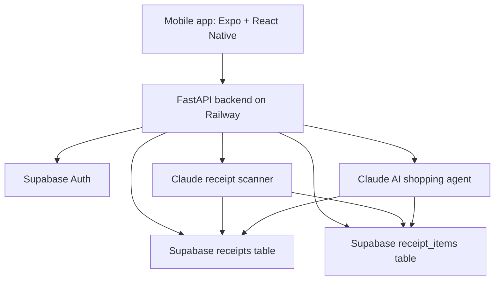

# ReceiptAI

Smart receipt scanning, price history, and an AI shopping agent for everyday purchase decisions.

ReceiptAI is a React Native mobile app that scans receipts, stores purchase history, and lets users ask natural questions about what they bought, where they paid less, and how they can save money. The app is powered by a FastAPI backend, Supabase Auth and database, and Claude for receipt extraction plus grounded shopping analysis.

## Product Snapshot

| Area | Details |
| --- | --- |
| Mobile app | React Native, Expo SDK 54, Expo Router |
| Backend | Python FastAPI hosted on Railway |
| Database | Supabase |
| Authentication | Supabase Auth with JWT user sessions |
| Trial mode | 24-hour guest sessions with isolated temporary data |
| AI scanning | Claude receipt extraction for printed and handwritten receipt content |
| AI agent | Claude reasoning grounded by structured receipt-item retrieval |
| OTA updates | EAS Update |

Production backend:

```text
https://web-production-3605f4.up.railway.app
```

Expo project ID:

```text
2325e79c-ae59-428e-b502-f1c9b971bccd
```

## What ReceiptAI Can Do

- Scan image and PDF receipts.
- Extract store, date, subtotal, tax, total, discounts, payment method, and line items.
- Detect handwritten receipt items, handwritten prices, and manual adjustments.
- Separate real returns/refunds from uncertain handwritten notes.
- Store receipt history per authenticated user.
- Support 24-hour guest mode without mixing guest data into user data.
- Ask questions such as:
  - "How many times did I buy this product?"
  - "Where did I buy it cheaper?"
  - "What are my top spending categories?"
  - "Show my monthly spending report."
  - "Compare prices across stores."
  - "What should I buy this month based on my history?"
- Match similar receipt items even when OCR text is slightly different.
- Treat product sizes like `2.00-GAL`, `10 OZ`, and `12 CT` as packaging, not quantity.

## Architecture



The app sends receipt uploads and chat requests to the backend. The backend validates the user or guest session, scans receipts with Claude, stores structured receipt data in Supabase, and creates normalized item rows for faster, more accurate AI answers.

## Repository Layout

```text
ReceiptScanner/
  app/
    LoginScreen.tsx
    _layout.tsx
    (tabs)/
      _layout.tsx
      index.tsx       # Scan screen
      receipts.tsx    # Receipt history
      agent.tsx       # AI Agent chat
      profile.tsx     # Account, sign out, appearance
  stores/
    authStore.ts
    themeStore.ts
    userStore.ts
  assets/
  app.json
  eas.json
  package.json
```

Important note: Zustand stores must stay in `stores/`, not inside `app/`. Expo Router treats files inside `app/` as routes.

## Local Setup

### Prerequisites

- Node.js LTS
- npm
- Expo CLI through `npx expo`
- Expo Go or a development build
- Backend running locally or deployed on Railway

### Install

```powershell
cd "C:\Users\ajayp\OneDrive\Documents\Ajay\Projects\Recepit Scanner\ReceiptScanner"
npm install
```

### Start the app

Expo SDK 54 can sometimes fail during its dependency doctor check with:

```text
TypeError: Body is unusable: Body has already been read
```

Use this startup command if that happens:

```powershell
$env:EXPO_NO_DOCTOR="1"; npx expo start -c
```

Normal startup:

```powershell
npx expo start -c
```

Then open the app with:

- `i` for iOS simulator
- `a` for Android emulator
- QR code with Expo Go

## Mobile App Behavior

### Authentication

The app intentionally starts at the Login / Signup / Guest screen. It does not auto-restore a previous user or guest session.

Expected flow:

1. User opens app.
2. Login, signup, or guest trial is shown.
3. Successful login/signup/guest start unlocks tabs.
4. Sign out clears the local auth state and returns to login.

### Guest Mode

Guest sessions are local 24-hour trials. A guest user has:

```ts
{
  id: "guest_<timestamp>_<random>",
  name: "Guest",
  email: "guest@receiptai.local",
  token: "guest",
  is_guest: true,
  guest_session_id: "guest_<timestamp>_<random>",
  created_at: "<ISO timestamp>",
  expires_at: "<ISO timestamp + 24 hours>"
}
```

Guest receipt API calls use:

```text
POST /guest/scan-receipt?session_id=<guest_session_id>
GET  /guest/receipts?session_id=<guest_session_id>
```

### Theme System

Dark and light modes are managed by `stores/themeStore.ts`.

The theme store exports:

```ts
useThemeStore
useTheme
getColors
loadTheme
```

The app uses those values across:

- Login screen
- Tab layout
- Scan screen
- Receipt history
- Profile and Appearance modal
- Root status bar

## Backend Contract

The mobile app currently points to:

```text
https://web-production-3605f4.up.railway.app
```

Main API routes:

| Method | Route | Purpose |
| --- | --- | --- |
| `POST` | `/auth/signup` | Create account and return session token |
| `POST` | `/auth/login` | Sign in and return JWT |
| `POST` | `/auth/logout` | Sign out |
| `DELETE` | `/auth/delete-account` | Delete account and user data |
| `POST` | `/scan-receipt` | Scan receipt for logged-in user |
| `POST` | `/guest/scan-receipt` | Scan receipt for guest session |
| `GET` | `/receipts` | List logged-in user's receipts |
| `GET` | `/guest/receipts` | List guest receipts |
| `GET` | `/summary` | Spending summary |
| `DELETE` | `/receipts/{receipt_id}` | Delete receipt |
| `POST` | `/agent/chat` | AI Agent chat |
| `POST` | `/agent/clear` | Clear agent session |
| `GET` | `/agent-health` | Agent route health |

Logged-in receipt scan:

```text
POST /scan-receipt
Authorization: Bearer <Supabase JWT>
```

Guest receipt scan:

```text
POST /guest/scan-receipt?session_id=<guest_session_id>
```

## Structured Receipt RAG

ReceiptAI does not rely only on an LLM guessing from raw receipt blobs. The backend creates structured item events and searches them before answering user questions.

Each item event can include:

| Field | Meaning |
| --- | --- |
| `item_name_original` | Original scanned receipt text |
| `item_name_normalized` | Search-friendly item name |
| `product_size` | Packaging size like `2.00-GAL` or `16 OZ` |
| `quantity` | Purchased quantity only when explicit |
| `unit_price` | Price per unit when known |
| `line_price` | Receipt line amount |
| `store` | Store name |
| `purchase_date` | Purchase date |
| `receipt_id` | Source receipt |
| `source` | Printed or handwritten |
| `confidence` | Extraction confidence |

Matching strategy:

1. Exact normalized match.
2. Product code match when available.
3. Token and fuzzy similarity for OCR variants.
4. Product-size aware matching.
5. Evidence-only answer generation.

Example rule:

```text
2.00-GAL ROSE PINK PREM
```

`2.00-GAL` is product size, not quantity. Quantity stays `1` unless the receipt explicitly says `QTY 2`, `2 @`, `2 EA`, or has a clear quantity column.

## Claude Receipt Extraction Rules

The scanner should extract:

- Printed items
- Handwritten items
- Handwritten prices
- Manual handwritten notes and adjustments
- Returned/refunded items only when clearly proven
- Subtotal, tax, total, discounts, payment method
- Validation notes and confidence metadata

Return/refund safety:

- Treat `RETURN`, `REFUND`, `VOID`, printed negative lines, or clear negative return context as returns.
- Do not automatically treat a small handwritten negative value like `-1.59` as a return.
- If uncertain, store the value as a manual adjustment or validation note.

## AI Agent Answer Style

The Agent should feel practical, natural, and analytical.

Good answer patterns:

- Short direct answer first.
- Use compact tables for price history or comparisons.
- Use simple text charts for monthly spending when useful.
- Give exactly 3 actionable saving recommendations for saving questions.
- Say "Based on the receipts available..." only when needed.
- Avoid repeating the user's question back with bad grammar.
- Avoid saying "database" or "records" unless the user asks technically.
- Avoid follow-up questions unless they are truly useful.

Example:

```text
Lowest price found: $12.49 at Lowe's on 05/09/26.

| Item | Store | Date | Qty | Price |
| --- | --- | --- | ---: | ---: |
| 2.00-GAL ROSE PINK PREM | Lowe's | 05/09/26 | 1 | $12.49 |
| 2.00-GAL ROSE PINK PREN | Lowe's | 05/09/26 | 1 | $24.98 |

Price difference: $12.49.
Note: 2.00-GAL is the product size, not quantity.
```

## Supabase Setup

Project ref:

```text
okzsqmoxdzrbhhdrsazy
```

Required backend tables include:

- `receipts`
- `receipt_items`

Run the structured item migration from the backend repo:

```text
BS/supabase_receipt_items.sql
```

How to run:

1. Open Supabase Dashboard.
2. Select project `okzsqmoxdzrbhhdrsazy`.
3. Go to SQL Editor.
4. Open `BS/supabase_receipt_items.sql`.
5. Copy the full SQL into the editor.
6. Click Run.

## OTA Updates

EAS Update is configured with:

```text
projectId: 2325e79c-ae59-428e-b502-f1c9b971bccd
runtimeVersion: appVersion
```

Useful commands:

```powershell
eas update --branch production --message "Update ReceiptAI"
```

## Troubleshooting

### Expo starts with "Body is unusable"

Use:

```powershell
$env:EXPO_NO_DOCTOR="1"; npx expo start -c
```

### Scan says "Authentication required"

Check:

- Logged-in scan sends `Authorization: Bearer <JWT>`.
- Guest scan uses `/guest/scan-receipt?session_id=<guest_session_id>`.
- Signup saves `data.session.access_token`.

### Expo Router warns about store files

Make sure these files do not exist:

```text
app/authStore.ts
app/themeStore.ts
app/userStore.ts
```

Stores belong here:

```text
stores/authStore.ts
stores/themeStore.ts
stores/userStore.ts
```

### Old tabs still resolve missing imports

Delete replaced AI Agent tabs if they exist:

```text
app/(tabs)/ask.tsx
app/(tabs)/shopping.tsx
app/(tabs)/price.tsx
```

### TypeScript fails in `app-example`

The `app-example` scaffold may still reference Expo starter aliases. The active app lives in `app/`.

## License

Private project. Add a license before making the repository public.
