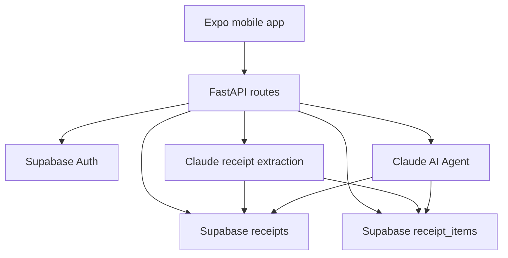

# ReceiptAI Backend

FastAPI backend for ReceiptAI, a smart receipt scanner and AI shopping agent.

This service authenticates users, scans receipts with Claude, stores receipt data in Supabase, builds normalized receipt-item rows, and powers the AI Agent with structured retrieval so answers stay grounded in real purchase evidence.

## Service Overview

| Area | Details |
| --- | --- |
| Framework | FastAPI |
| Hosting | Railway |
| Database | Supabase |
| Auth | Supabase Auth JWT |
| AI provider | Anthropic Claude |
| Receipt inputs | Images and PDFs |
| Agent retrieval | Structured receipt-item RAG |
| Guest mode | 24-hour isolated guest sessions |

Production URL:

```text
https://web-production-3605f4.up.railway.app
```

## Architecture



## Repository Layout

```text
ReceiptScanner/
  mobile/
  backend/
    main.py
    app/
      config.py
      routes/
        auth.py
        receipts.py
        queries.py
        agent_route.py
      services/
        claude.py
        database.py
        agent.py
    supabase_receipt_items.sql
    requirements.txt
    Procfile
    nixpacks.toml
```

## Environment Variables

Create a `.env` file locally and configure the same variables in Railway.

```env
ANTHROPIC_API_KEY=your_anthropic_api_key
SUPABASE_URL=https://your-project.supabase.co
SUPABASE_KEY=your_supabase_service_or_anon_key
CLAUDE_AGENT_MODEL=claude-opus-4-5-20251101
CLAUDE_SONNET_MODEL=claude-sonnet-4-5-20250929
CLAUDE_SCAN_MODEL=claude-sonnet-4-5-20250929
PASSWORD_RESET_REDIRECT_URL=receiptai://reset-password

# Optional: GPT brain for messy chat intent and general advice
OPENAI_API_KEY=your_openai_api_key
OPENAI_ROUTER_MODEL=gpt-4o-mini
OPENAI_GENERAL_MODEL=gpt-4o-mini
AGENT_OPENAI_ENABLED=true

# Optional: public meaning lookup for item aliases only
GOOGLE_SEARCH_API_KEY=your_google_custom_search_api_key
GOOGLE_SEARCH_ENGINE_ID=your_google_programmable_search_engine_id
```

Do not commit real API keys.

### Optional OpenAI Brain Layer

ReceiptAI can use OpenAI for the chat understanding layer while keeping receipt truth inside deterministic RAG.

Use it for:

- messy grammar and typo intent routing
- general shopping or food-safety questions
- multilingual/simple wording normalization

Important: OpenAI does not decide receipt prices. The final item, store, quantity, and price still come from saved receipt evidence.

To enable it in Railway, add:

```env
OPENAI_API_KEY=...
OPENAI_ROUTER_MODEL=gpt-4o-mini
OPENAI_GENERAL_MODEL=gpt-4o-mini
AGENT_OPENAI_ENABLED=true
```

If these variables are missing, ReceiptAI falls back to Claude and the deterministic router.

### Optional Google Meaning Layer

ReceiptAI can use Google Custom Search to understand public item meanings and aliases. This is only used to improve query understanding, for example:

- `brinjal` means `eggplant`
- `pitaya` means `dragon fruit`
- `coriander` means `cilantro`

Important: Google results are never used as the user's receipt prices. Final prices, stores, dates, and quantities still come only from the user's saved receipts.

To enable it:

1. Create a Google Cloud API key with Custom Search JSON API enabled.
2. Create a Programmable Search Engine.
3. Add these Railway variables:

```env
GOOGLE_SEARCH_API_KEY=...
GOOGLE_SEARCH_ENGINE_ID=...
```

If these variables are missing, the backend still works. It uses built-in aliases, user-taught aliases, and receipt RAG.

## Local Setup

From the monorepo root:

```powershell
cd backend
python -m venv .venv
.\.venv\Scripts\Activate.ps1
pip install -r requirements.txt
uvicorn main:app --reload
```

Local API:

```text
http://127.0.0.1:8000
```

FastAPI docs:

```text
http://127.0.0.1:8000/docs
```

## API Routes

### Auth

| Method | Route | Purpose |
| --- | --- | --- |
| `POST` | `/auth/signup` | Create account and return user plus session token |
| `POST` | `/auth/login` | Sign in and return user plus session token |
| `POST` | `/auth/logout` | Sign out |
| `DELETE` | `/auth/delete-account` | Delete user account and receipt data |

Signup must return:

```json
{
  "success": true,
  "user": {
    "id": "supabase-user-id",
    "email": "user@example.com",
    "name": "User"
  },
  "session": {
    "access_token": "jwt",
    "refresh_token": "refresh-token"
  }
}
```

### Receipts

| Method | Route | Purpose |
| --- | --- | --- |
| `POST` | `/scan-receipt` | Scan receipt for authenticated user |
| `POST` | `/guest/scan-receipt?session_id=...` | Scan receipt for guest |
| `GET` | `/receipts` | List authenticated user's receipts |
| `GET` | `/guest/receipts?session_id=...` | List guest receipts |
| `GET` | `/summary` | Spending summary |
| `DELETE` | `/receipts/{receipt_id}` | Delete receipt |
| `DELETE` | `/guest/cleanup` | Clean expired guest receipts |

Authenticated scan:

```text
POST /scan-receipt
Authorization: Bearer <Supabase JWT>
Content-Type: multipart/form-data
```

Guest scan:

```text
POST /guest/scan-receipt?session_id=<guest_session_id>
Content-Type: multipart/form-data
```

### AI Agent

| Method | Route | Purpose |
| --- | --- | --- |
| `POST` | `/agent` | Agent request |
| `POST` | `/agent/` | Agent request alias |
| `POST` | `/agent/chat` | Chat-style Agent request |
| `POST` | `/agent/clear` | Clear conversation state |
| `GET` | `/agent-health` | Health check |

## Receipt Scanning Rules

Claude extraction should return structured JSON with:

- `items`
- `handwritten_items`
- `returned_items`
- `manual_adjustments`
- `subtotal`
- `tax`
- `total`
- `validation`
- `validation_notes`

Important interpretation rules:

- Extract handwritten product names and handwritten prices when visible.
- Do not assume every negative handwritten number is a return.
- Classify a return only when there is clear evidence such as `RETURN`, `REFUND`, `VOID`, a printed negative line, or explicit return context.
- Store uncertain handwritten values as manual adjustments or validation notes.
- Treat product sizes as packaging, not quantity.

Example:

```text
5331976 2.00-GAL ROSE PINK PREM 24.98
```

Correct interpretation:

```json
{
  "name": "2.00-GAL ROSE PINK PREM",
  "product_size": "2.00-GAL",
  "quantity": 1,
  "unit": "each",
  "line_price": 24.98
}
```

Do not infer quantity `2` from `2.00-GAL`.

## Structured Receipt-Item RAG

The Agent uses deterministic retrieval before Claude writes the final answer.

Flow:

1. Fetch receipts for the authenticated user or guest session.
2. Read normalized item rows from `receipt_items`.
3. Normalize query and item names.
4. Match exact names, product codes, product sizes, and fuzzy OCR variants.
5. Retrieve matching purchase events.
6. Give Claude only the retrieved evidence and answer from that evidence.

This prevents common mistakes such as:

- Saying an item was purchased once when OCR variants show it twice.
- Combining two receipts into quantity `2`.
- Treating `2.00-GAL` as quantity.
- Guessing prices that are not present in the receipts.

## Supabase Migration

Run this file once in the Supabase SQL Editor:

```text
supabase_receipt_items.sql
supabase_item_aliases.sql
```

Steps:

1. Open Supabase Dashboard.
2. Select project `okzsqmoxdzrbhhdrsazy`.
3. Open SQL Editor.
4. Copy the contents of `backend/supabase_receipt_items.sql`.
5. Paste into a new SQL query.
6. Click Run.
7. Repeat for `backend/supabase_item_aliases.sql`.

The migrations create:

- `receipt_items` for fast structured Agent answers.
- `receipt_item_aliases` for user-taught item meanings such as `goat = mutton`.

## Guest Data Policy

Guest receipts are stored with:

```text
is_guest = true
guest_session_id = <session id>
expires_at = now + 24 hours
```

Guest queries must filter by:

```text
is_guest = true
guest_session_id = <session id>
```

The app also runs cleanup logic to remove expired guest data.

## Agent Response Guidelines

The Agent should:

- Answer directly and naturally.
- Use tables for item comparisons and price history.
- Use simple chart-style summaries for spending trends when useful.
- Give exactly 3 recommendations for saving-money questions.
- Avoid generic advice like "scan more receipts" unless there are no receipts.
- Avoid repeating the user's question as the answer.
- Avoid saying "database" or "records" in customer-facing answers.
- Say "Based on the receipts available..." only when needed.

## Deployment

Railway uses:

```text
Procfile
nixpacks.toml
requirements.txt
```

Typical deploy flow from the monorepo root:

```powershell
git status
git add backend
git commit -m "Improve ReceiptAI backend"
git push
```

Railway redeploys from the connected GitHub repository.

## Troubleshooting

### `Authentication required` during scan

Check:

- Mobile app sends `Authorization: Bearer <JWT>` for logged-in users.
- Guest scans call `/guest/scan-receipt?session_id=<guest_session_id>`.
- Signup/login returns and saves `session.access_token`.

### Duplicate detection affects another user

Duplicate checks must be owner-scoped:

- Use `user_id` for logged-in users.
- Use `guest_session_id` for guest users.
- Never check only by global `image_hash`.

### `column receipts.handwritten_items does not exist`

Do not query non-existing columns directly. Handwritten items should be read from receipt JSON or normalized into `receipt_items`.

### Agent gives vague or incorrect answers

Check:

- `receipt_items` migration has been run.
- New scans are writing normalized item rows.
- Agent is using structured retrieval before Claude response generation.
- Product-size tokens are not being treated as quantities.

## Commit Commands

Use repository-relative paths so the commands work on any machine.

```powershell
git status
git add backend/README.md
git commit -m "Update backend documentation"
git push
```

## License

Private project. Add a license before making the repository public.
